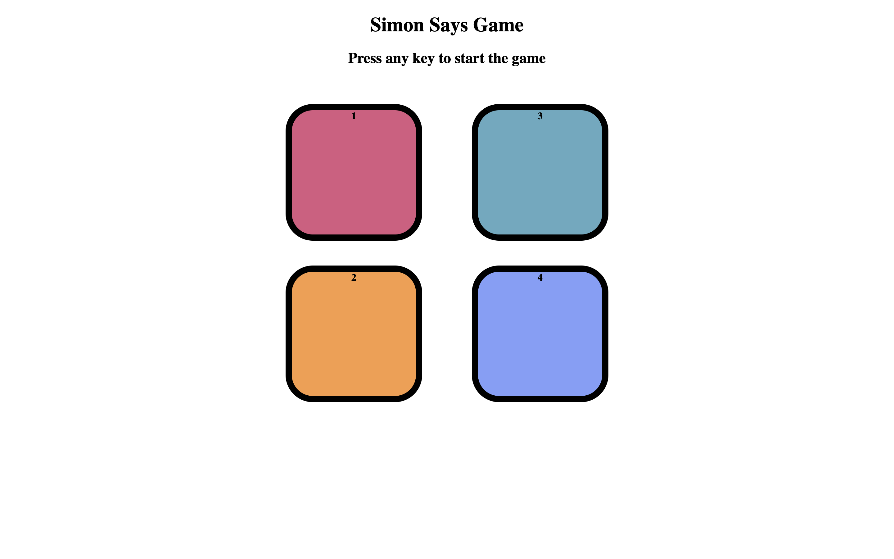
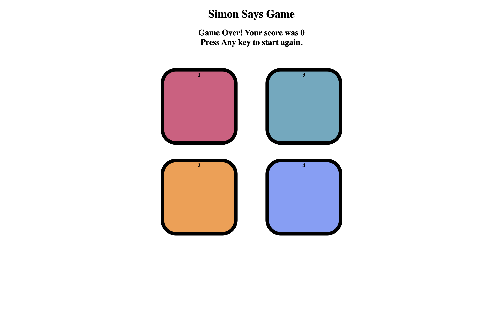

# 🎮 Simon Game

A fun and interactive **Simon Says memory game** built using **HTML, CSS, and JavaScript**.  
The game challenges the player to remember and repeat an ever-growing sequence of colors.

This project demonstrates strong fundamentals in **DOM manipulation, event handling, and game logic** using vanilla JavaScript.

🔗 **Live Demo**: https://vivekcode12345.github.io/simon-game/

---

## 🖼️ Screenshots

### Game Start


### Gameplay


### Game Over


> Add screenshots inside a `screenshots` folder with the same file names.

---

## 🚀 Features

- Four interactive colored buttons
- Memory-based sequence gameplay
- Visual flash animation for system and user inputs
- Level-based progression system
- Game over detection on incorrect input
- Restart game using keyboard input
- Clean and responsive user interface

---

## 🛠️ Tech Stack

- **HTML5** – Structure and layout
- **CSS3** – Styling and animations
- **JavaScript (Vanilla)** – Game logic and interactivity

---

## 📂 Project Structure

---

## 🎯 How to Play

1. Press any key to start the game
2. Observe the color sequence displayed by the game
3. Repeat the sequence by clicking the buttons in the same order
4. Each level adds a new color to the sequence
5. A wrong input ends the game
6. Press any key to restart

---

👨‍💻 Author

Vivek Verma
B.Tech Student
GitHub: https://github.com/vivekcode12345

## ⚙️ Installation and Setup

1. Clone the repository:
   ```bash
   git clone https://github.com/vivekcode12345/simon-game.git

